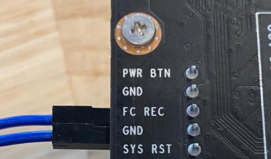
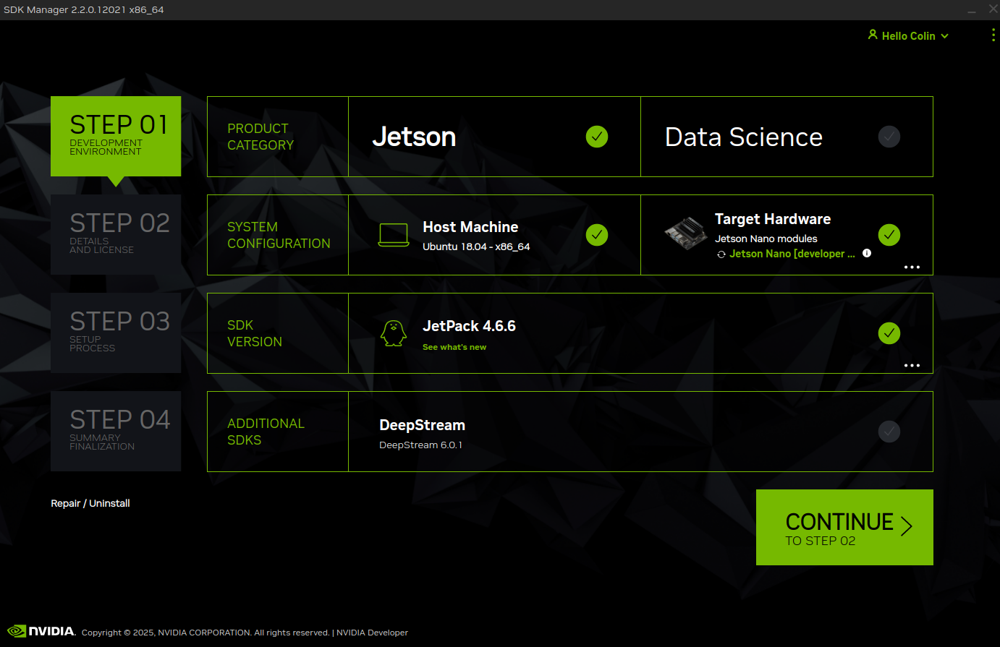
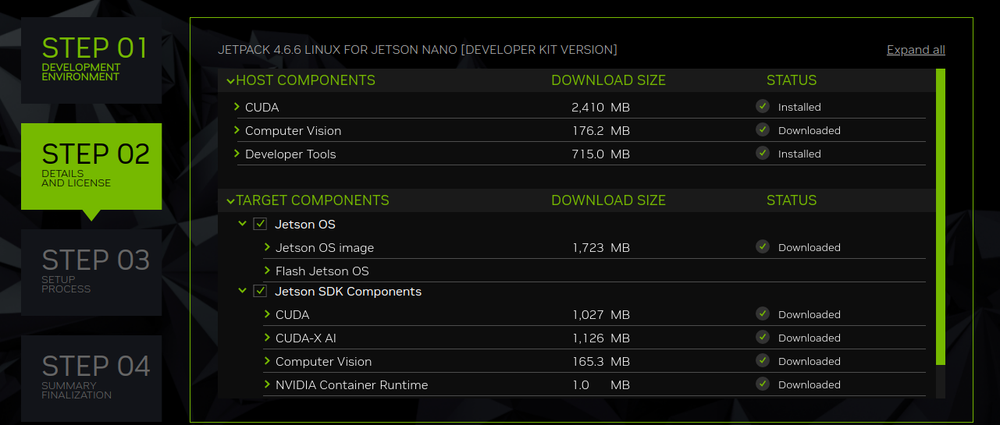
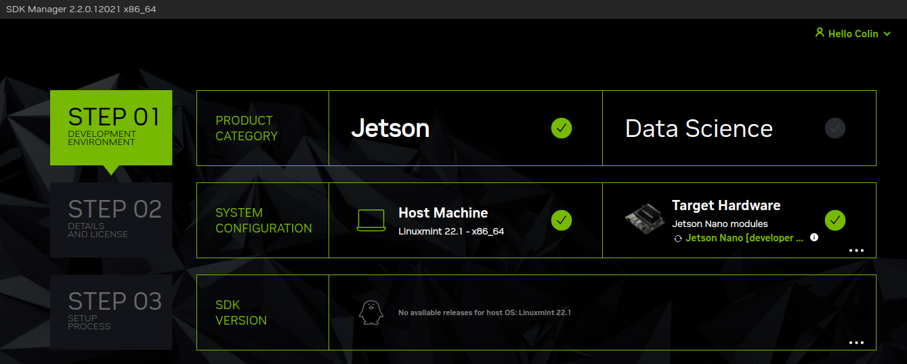
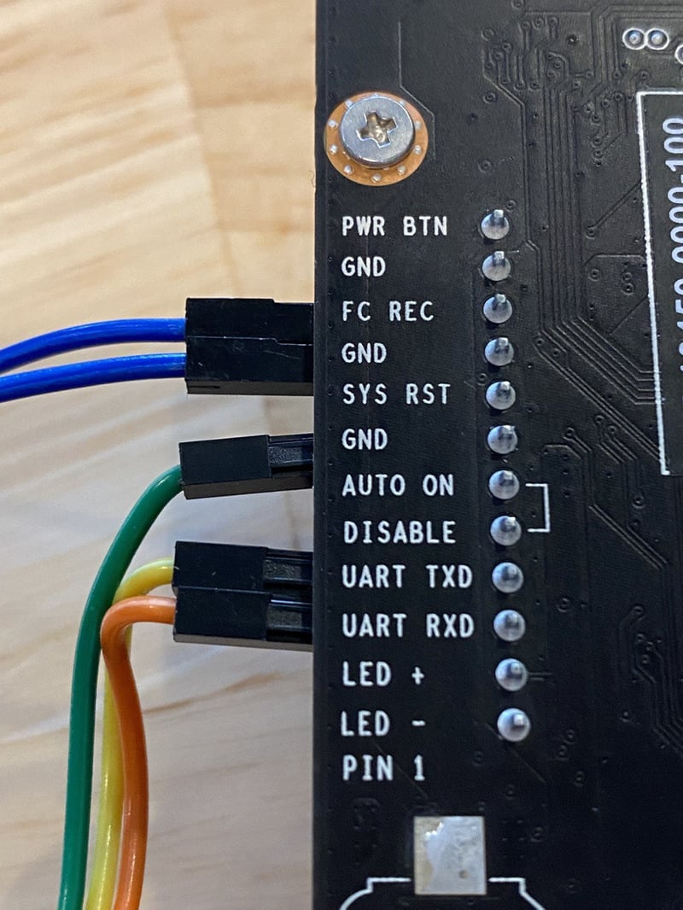

# JetRacer perfomence optimierte Installationsanweisung

**Vorwort**

Dieses Anleitung bietet einen umfassenden Leitfaden zur Einrichtung und Konfiguration des JetRacer-Projekts mit dem NVIDIA Jetson Nano Developer Kit (4GB B01). Es deckt alle wesentlichen Schritte ab – von der Hardwarevorbereitung, der Einrichtung des Entwicklungs-Workspaces, der Installation von ROS und zusätzlicher Abhängigkeiten bis hin zum Flashen des Systems mit dem NVIDIA SDK Manager.

Ein wichtiger Aspekt dieser Anleitung ist die zielgerichtete Optimierung des Systems. Im Gegensatz zu dem vorgefertigten Waveshare-Image, das mit zahlreichen Zusatzfunktionen ausgestattet ist und damit unnötig Ressourcen bindet, wurden in diesem Handbuch alle überflüssigen Komponenten weggelassen. So bleibt mehr Leistung für die zentralen Aufgaben des Projekts verfügbar – was zu einer besseren Performance und einer stabileren Systemumgebung führt.

## 1. Flashen mit NVIDIA SDK

### 1.1 Voraussetzungen
- Ein physischer Computer mit Ubuntu 18.04 (keine virtuelle Maschine!)  
  > Das Flashen sollte m
Beachte:  
- Sichere zunächst die Originaldatei, damit du sie bei Bedarf wiederherstellen kannst.  
- Nach Abschluss des Flashvorgangs kannst du die ursprüngliche `/etc/os-release` wiederherstellen.it den meisten Ubuntu-basierten Distributionen funktionieren. Die Versionsüberprüfung, muss dafür aber umgangen werden (siehe Kapitel 1.6: Flashen mit Ubuntu-basierten Distributionen).
- Der NVIDIA SDK Manager (herunterladbar unter https://developer.nvidia.com/sdkmanager)
- Ein kompatibler 5V/4A Netzadapter (nur notwendig, wenn ohne Akkupack installiert wird)
- Ein USB-Datenkabel (Micro-USB) zum Verbinden des Jetson Nano mit dem Host
- Jumper (Dupont-Kabel) zum Setzen der Recovery-Funktion und zur Konfiguration der Stromversorgung


### 1.2 Hardware-Vorbereitung
- **Stromversorgung:**  
  Da der Flash-Vorgang lange dauert, ist eine stabile, externe Stromversorgung zwingend notwendig.  
  - **Mit installiertem Akkupack (JetRacer-Betrieb):**  
    Kann das Netzteil, das normalerweise zum Laden des Akkupacks verwendet wird, übernehmen.  
  - **Einzelbetrieb des Jetson Nano (ohne Akkupack):**  
    Wird der Jetson Nano einzeln geflasht, muss er über ein externes Netzteil am J25 Power Jack betrieben werden.  
    Hierfür muss der entsprechende Jumper an den J48-Pins gesetzt werden, damit der Micro-USB-Anschluss ausschließlich für die serielle Verbindung genutzt wird – denn ein Standard-USB-Anschluss liefert nicht genügend Leistung.

### 1.3 Versetzen in den Recovery-Modus
- Schalte den Jetson Nano aus.
- Setze den Jumper über die Recovery-Pins
- **Pin-Belegung für den Recovery-Modus:**
    - **FC_REC → GND:**

    
- Verbinde das USB-Datenkabel mit dem Micro-USB-Anschluss deines Jetson Nano.
- Schalte das Gerät ein. Sobald das Gerät im Recovery-Modus gestartet ist, kann der Jumper entfernt werden (wenn nach Flashen ein normaler Reboot erfolgen soll).

### 1.4 Flash-Vorgang mit dem NVIDIA SDK Manager
- Starte den NVIDIA SDK Manager auf deinem Ubuntu 18.04 Host.
- Melde dich mit deinen NVIDIA-Zugangsdaten an.
- Wähle als Zielgerät den "Jetson Nano Developer Kit" (B01).

    

- Wähle den Flash-Vorgang, der das vollständige Betriebssystem-Image (und die weiteren Komponenten) auf das interne Speichermedium (SD-Karte) des Jetson Nano überträgt.
    
- Akzeptiere die Bedingungen und Folge den Anweisungen des SDK Managers. Achte darauf, dass dein Jetson Nano korrekt im Recovery-Modus erkannt wird.
- Der Flash-Vorgang kann mehrere Minuten Stunden dauern. Überwache den Fortschritt in der Konsole des SDK Managers.
- Sollte die nachfragemehrmals vom SDK-Manager kommen das der vorgang ungewöhnlich lange dauert kann der vorgang abgebrochen werden und es muiss von vorne begonnen werden.
- Nach Abschluss des Flash-Vorgangs startet der Jetson Nano neu.

### 1.5 Nachbereitung
- Trenne das USB-Datenkabel.
- Entferne ggf. den Jumper für die externestromversorgung

### 1.6 Flashen mit Ubuntu-basierten Distributionen

Falls du eine Ubuntu-basierte Distribution verwendest, die vom SDK Manager offiziell nicht unterstützt wird, kannst du diesen Versionscheck umgehen, indem du die Datei `/etc/os-release` temporär überschreibst. 


Ersetze den Inhalt der Datei `/etc/os-release` mit den folgenden Daten:
```bash
NAME="Ubuntu"
VERSION="18.04.6 LTS (Bionic Beaver)"
ID=ubuntu
ID_LIKE=debian
PRETTY_NAME="Ubuntu 18.04.6 LTS"
VERSION_ID="18.04"
HOME_URL="https://www.ubuntu.com/"
SUPPORT_URL="https://help.ubuntu.com/"
BUG_REPORT_URL="https://bugs.launchpad.net/ubuntu/"
PRIVACY_POLICY_URL="https://www.ubuntu.com/legal/terms-and-policies/privacy-policy"
VERSION_CODENAME=bionic
UBUNTU_CODENAME=bionic
```

>Beachte:  
>- Sichere zunächst die Originaldatei, damit du sie bei Bedarf wiederherstellen kannst.  
>- Nach Abschluss des Flashvorgangs kannst du die ursprüngliche `/etc/os-release` wiederherstellen.

Du kannst dazu auch das dieses script nutzen
```bash
v#!/bin/bash

# Pfad zur os-release Datei
OS_RELEASE="/etc/os-release"

# Temporäre Datei erstellen
TEMP_FILE=$(mktemp)

# Originale os-release Datei sichern
echo "Sichere aktuelle $OS_RELEASE nach $TEMP_FILE..."
sudo cp $OS_RELEASE $TEMP_FILE

# Neue os-release Daten für Ubuntu 18.04 erstellen
echo "Ersetze $OS_RELEASE durch Ubuntu 18.04 Daten..."
sudo bash -c "cat > $OS_RELEASE" <<EOL
NAME="Ubuntu"
VERSION="18.04.6 LTS (Bionic Beaver)"
ID=ubuntu
ID_LIKE=debian
PRETTY_NAME="Ubuntu 18.04.6 LTS"
VERSION_ID="18.04"
HOME_URL="https://www.ubuntu.com/"
SUPPORT_URL="https://help.ubuntu.com/"
BUG_REPORT_URL="https://bugs.launchpad.net/ubuntu/"
PRIVACY_POLICY_URL="https://www.ubuntu.com/legal/terms-and-policies/privacy-policy"
VERSION_CODENAME=bionic
UBUNTU_CODENAME=bionic
EOL

echo "Die Datei $OS_RELEASE wurde überschrieben."
echo "Die originale Datei ist unter $TEMP_FILE gesichert."

# Hinweis für die Rücksetzung
echo "Um die ursprüngliche Datei wiederherzustellen, führe folgenden Befehl aus:"
echo "sudo cp $TEMP_FILE $OS_RELEASE"
```
## 2. Verbindung herstellen

*Hinweis:* Die Einrichtung erfolgt komplett ohne Bildschirm, Maus und Tastatur am Jetson Nano. Obwohl eine Desktop-Umgebung verfügbar ist, ist deren Nutzung aufgrund des begrenzten Arbeitsspeichers (4 GB) nicht zu empfehlen.

**Ziel:**  
Schaffen einer stabilen Verbindung, um Konfigurations- und Verwaltungsaufgaben auf dem JetRacer durchzuführen. Die temporären Methoden dienen als Ausgangspunkt, um das System auf eine permanente WLAN-Verbindung umzustellen, die automatisch mit dem System startet, ohne dass ein Benutzer-Login notwendig ist.

### 2.1 Temporäre Verbindung

#### 2.1.1 USB-to-Serial-Adapter
- **Pin-Layout:**  
  Verbinde den Adapter mit den GPIO-Pins des Jetson Nano:
  - **TX (Adapter) → RX (Jetson Nano)**
  - **RX (Adapter) → TX (Jetson Nano)**
  - **GND → GND**


- **Wichtig:**  
  Das blaue Kabel (Jumper) zum Recovery-Modus ist hier nicht notwendig.


  
*Weiter geht’s im Schritt 2.2.1*

#### 2.1.2 USB-Port des Jetson Nano
- Verbinde den JetRacer über den Micro-USB-Port des Jetson Nano mit vorzugsweise einem USB 2.0-Port am Konfigurationsrechner.
- Achte darauf, ein Kabel zu verwenden, das für serielle Verbindungen geeignet ist – nicht etwa ein Kabel, das ausschließlich zum Laden konzipiert ist.
- Zusätzlich muss eine externe Stromverbindung angeschlossen sein. Beim zusammengebauten JetRacer werden in der Regel die Akkus verwendet. Wird jedoch nur das Jetson Nano betrieben, so ist dieses über ein separates Netzteil zu versorgen, um den Micro-USB-Port für den Serielmodus nutzen zu können.
- Um den Serielmodus zu aktivieren, muss der Nano in den Recovery-Modus versetzt werden. Hierfür reicht es aus, die Brücke beim Systemstart zu setzen; nach dem Start kann die Brücke im laufenden Betrieb wieder entfernt werden. Nach einem Reboot startet der Nano dann wieder regulär.

- **Pin-Belegung für den Recovery-Modus:**
- **FC_REC → GND:**

  
  *Visualisierung findest du im Bild unter **2.1.1 USB-to-Serial-Adapter**.
  Du kannst entweder ein Kabel wie auf dem Bild zu sehen ist verwenden oder einen einfachen Jumper.*

*Weiter geht’s im Schritt 2.2.1*


#### 2.1.3 Direkte LAN-Verbindung
- Verbinde den JetRacer und den Entwicklungsrechner mit einem Ethernet-Kabel.
- Standardmäßig ist auf dem Jetson Nano die IP-Adresse 192.168.55.1/24 eingestellt.
- Wenn der Konfigurationsrechner über DHCP automatisch konfiguriert wird, sollte ihm eine passende IP-Adresse aus dem gleichen Netz zugewiesen werden. Andernfalls muss manuell eine IP-Adresse aus dem Netz (z. B. 192.168.55.x) konfiguriert werden.

*Weiter geht’s im Schritt 2.2.2*

### 2.2 Terminalzugang

**Standard-Zugangsdaten:**  
- **Benutzername:** `jetson`  
- **Passwort:** `jetson`

> Hinweis: Diese Standard-Zugangsdaten gelten für den Jetson Nano, sofern nicht anders konfiguriert. Es wird empfohlen, sie aus Sicherheitsgründen nach der ersten Inbetriebnahme zu ändern.


#### 2.2.1 Serieal über minicom
  - Starte minicom über das Terminal mit folgender Kommandozeile:
    ```bash
    minicom -b 115200 -o -D /dev/ttyUSB0
    ```
    *(Hinweis: Ersetze `/dev/ttyUSB0` durch das passende Gerät, falls erforderlich.)*

    > **Hinweise zur Geräteerkennung:**  
    > Falls das passende Gerät nicht sofort ersichtlich ist, kannst du nach Anschluss des USB-Kabels den folgenden Befehl ausführen:
    > 
    > ```bash
    > dmesg | grep tty
    > ```
    > 
    > Dadurch wird angezeigt, welches Gerät neu erkannt wurde (z. B. `/dev/ttyUSB0` oder `/dev/ttyUSB1`). Alternativ kannst du mit:
    > 
    > ```bash
    > ls /dev/ttyUSB*
    > ```
    > 
    > alle verfügbaren USB-Serial-Geräte auflisten. Stelle sicher, dass das erkannte Gerät tatsächlich mit dem Jetson Nano verbunden ist, bevor du es in deiner Terminalanwendung wie minicom verwendest.
  - In minicom:
    - Drücke `Ctrl-A` gefolgt von `O`, um in die Einstellungen zu gelangen.
    - Navigiere zu den „Serial port setup“-Optionen und deaktiviere die Hardware-Flusskontrolle.
    - Speichere die Einstellungen und verlasse das Konfigurationsmenü.
  - Danach kannst du im minicom-Fenster direkt Befehle eingeben und ausführen.

#### 2.2.2 Via SSH

 Stelle sicher, dass dein Konfigurationsrechner im selben Netzwerk wie der Jetson Nano ist (z. B. über eine direkte Ethernet-Verbindung oder ein bestehendes Netzwerk).
- Standardmäßig ist auf dem Jetson Nano die IP-Adresse 192.168.55.1/24 eingestellt. Falls diese geändert wurde, ermittle die aktuelle IP-Adresse.
- Öffne ein Terminal auf deinem Konfigurationsrechner und verbinde dich per SSH:
  ```bash
  ssh <benutzername>@192.168.55.1
  ```
  (Ersetze <benutzername> durch den tatsächlichen Benutzernamen auf dem Jetson Nano.)

    Nach Eingabe des Befehls wirst du zur Eingabe des Passworts aufgefordert. Gib das entsprechende Passwort ein, um die Verbindung herzustellen.
    Sobald die Verbindung steht, kannst du Befehle direkt auf dem Jetson Nano ausführen.

### 2.3 Einrichtung WLAN

**Ziel:**  
Der JetRacer wird so konfiguriert, dass er eine dauerhafte WLAN-Verbindung herstellt, die automatisch beim Systemstart aufgebaut wird – bereits vor dem Nutzer-Login.

**Schritte:**

1. **Netzwerksuche:**  
   Führe den folgenden Befehl aus, um verfügbare Netzwerke anzuzeigen:

   ```bash
   sudo nmcli device wifi list
   ```

2. **Verbindung herstellen:**  
   Wähle ein Netzwerk aus und verbinde dich mit:

   ```bash
   sudo nmcli device wifi connect <ssid_name> password <password>
   ```
    > (Ersetze <ssid_name> und <password> durch den entsprechenden Netzwerk-Namen und das Passwort.)

3. **Verbindung prüfen:**  
   Teste die Verbindung, indem du die IP-Adresse anpingst oder per SSH erneut einloggst.  
   Befehle:
   - `nmcli device show` (Statusabfrage)
   - `ifconfig` (Netzwerkkonfiguration anzeigen)

4. **Dauerhafte Verbindung aktivieren:**  
   - Ermittle zunächst den Namen der bestehenden Verbindung:

     ```bash
     nmcli connection show
     ```

   - Setze die Verbindung auf automatische Wiederverbindung:

     ```bash
     nmcli connection modify <connection-name> connection.autoconnect yes
     ```
     >(Ersetze <connection-name> durch den tatsächlichen Namen der Verbindung.)

   - Überprüfe die Einstellungen:

     ```bash
     nmcli connection show <connection-name>
     ```

## 3. Installation von ROS     
### 3.1 Vorbereitung

In diesem Schritt wird das ROS-Software-Repository in dein Ubuntu-System integriert und dessen Sicherheitszertifikat (Key) konfiguriert. Dies ist notwendig, damit dein System die ROS-Pakete aus dem offiziellen Repository herunterladen und installieren kann.

#### 3.1.1 **Repository hinzufügen:**  
   Öffne das Terminal und füge das ROS-Repository zu deiner APT-Quellenliste hinzu. Der Befehl nutzt `lsb_release -sc`, um automatisch den Codenamen deiner Ubuntu-Version (z. B. "focal", "bionic") zu ermitteln. Dadurch erhältst du die für deine Ubuntu-Version passenden ROS-Pakete.  
   Führe folgenden Befehl aus:
   ```bash
   sudo sh -c 'echo "deb http://packages.ros.org/ros/ubuntu $(lsb_release -sc) main" > /etc/apt/sources.list.d/ros-latest.list'
   ```
   Dieser Befehl schreibt die Repository-Informationen in eine neue Datei namens `ros-latest.list` im Verzeichnis `/etc/apt/sources.list.d/`.

#### 3.1.2 **Repository-Schlüssel konfigurieren:**  
   Damit dein System den Inhalt des ROS-Repositories als vertrauenswürdig einstuft, muss der zugehörige GPG-Schlüssel importiert werden. Dieser Schlüssel verifiziert die Integrität und Authentizität der heruntergeladenen Pakete. Ohne diesen Schritt könnten die Downloads blockiert oder als unsicher markiert werden.  
   Führe folgenden Befehl aus:
   ```bash
   sudo apt-key adv --keyserver 'hkp://keyserver.ubuntu.com:80' --recv-key C1CF6E31E6BADE8868B172B4F42ED6FBAB17C654
   ```
   Dieser Befehl kontaktiert den Schlüsselserver von Ubuntu und lädt den Schlüssel herunter, der mit dem ROS-Repository verknüpft ist.

Durch diese beiden Schritte stellst du sicher, dass dein System korrekt konfiguriert ist, um ROS-Pakete aus dem offiziellen Repository zu beziehen. Dies bildet die Grundlage für alle weiteren Installations- und Aktualisierungsvorgänge im Rahmen der ROS-Installation.

### 3.2 ROS-Software Installation

#### 3.2.1 ROS Melodic Installation (Desktop-Full)

Nach dem Hinzufügen des neuen ROS-Repositories und der Konfiguration des zugehörigen Schlüssels müssen die Paketquellen aktualisiert werden. Dies erfolgt mit:
```bash
sudo apt-get update
```
Für diese Installation wählen wir die Desktop-Full-Variante, da sie alle wesentlichen Tools und Bibliotheken enthält – darunter auch rviz –, die für grafische Anwendungen benötigt werden. Insbesondere ermöglicht die Installation von Desktop-Full, dass du grafische Anwendungen wie rviz über SSH-X-Forwarding (z. B. mit "ssh -X" oder "ssh -Y") nutzen kannst.

Um ROS Melodic in der Desktop-Full-Variante zu installieren, führe folgenden Befehl aus:
```bash
sudo apt install ros-melodic-desktop-full
```
### 3.3 Einrichtung der Umgebung und Installation der ROS-Abhängigkeiten

Um sicherzustellen, dass die ROS-Umgebungsvariablen automatisch gesetzt werden und alle erforderlichen ROS-Abhängigkeiten installiert sind, führe die folgenden Schritte aus:

1. **Umgebungsvariablen hinzufügen:**  
   Füge den folgenden Befehl in deine Bash-Konfigurationsdatei ein, sodass die ROS-Umgebung bei jedem Start einer neuen Shell geladen wird:
   ```bash
   echo "source /opt/ros/melodic/setup.bash" >> ~/.bashrc
    ```
2. **Umgebungsvariablen aktivieren:**  
   Lade die aktualisierte Konfiguration in die aktuelle Shell:
   ```bash
   source ~/.bashrc
    ```
3. **ROS-Abhängigkeiten installieren:**  
   Installiere die notwendigen ROS-Pakete und Entwicklungswerkzeuge mit:
   ```bash
   sudo apt-get install python-rosinstall python-rosinstall-generator python-wstool build-essential
   ``` 
### 3.4 Initialisierung von rosdep

Bevor du ROS verwendest, musst du rosdep initialisieren. rosdep hilft dabei, den Quellcode sowie die benötigten Systemabhängigkeiten für die Kernkomponenten von ROS zu installieren. Führe dazu die folgenden Befehle im Terminal aus:
 ```bash
sudo apt install python-rosdep
sudo rosdep init
rosdep update
``` 
### 3.5 Verifizierung der ROS-Umgebung

Um sicherzustellen, dass das ROS-System korrekt funktioniert, kannst du zunächst den ROS-Master starten, der als Node-Manager fungiert. Öffne dazu ein Terminal und führe folgenden Befehl aus:
 ```bash
roscore
 ```
> **Optionaler Schritt: Demonstration der ROS-Willkommensanwendung mit turtlesim**  
> 
> Als Beispiel kannst du das Paket "turtlesim" verwenden, das eine einfache 2D-Simulation einer Schildkröte bietet:
> 
> 1. **ROS-Master starten:**  
>    Öffne ein Terminal und starte den ROS-Master:
>    ```bash
>    roscore
>    ```
> 
> 2. **turtlesim-Knoten starten:**  
>    Öffne ein zweites Terminal und starte den turtlesim-Knoten:
>    ```bash
>    rosrun turtlesim turtlesim_node
>    ```
>    Dadurch öffnet sich ein Fenster, in dem eine Schildkröte angezeigt wird.
> 
> 3. **turtlesim per Tastatur steuern:**  
>    Öffne ein drittes Terminal, um die Schildkröte mit der Tastatur zu steuern:
>    ```bash
>    rosrun turtlesim turtle_teleop_key
>    ```
>    Mit den Pfeiltasten kannst du die Schildkröte bewegen.
> 

## 4. Einrichtung des JetRacer-Projektes
### 4.1 Einrichtung des Workspaces

Richte einen catkin_ws-Workspace ein und lege das Projekt in dieses Verzeichnis. Führe dazu folgende Befehle aus:

1. Erstelle den Workspace-Ordner:
   ```bash
   mkdir -p ~/catkin_ws/src
   ```

2. Wechsle in das Verzeichnis:
    ```bash
   cd ~/catkin_ws
    ```
3. Kompiliere den Workspace:
    ```bash
   catkin_make
    ```
4. Füge die erforderlichen Umgebungsvariablen hinzu, sodass der Workspace bei jedem neuen Terminal automatisch geladen wird:
    ```bash
   sudo sh -c 'echo "source ~/catkin_ws/devel/setup.bash" >> ~/.b
    ```
5. Lade die aktualisierte bash-Konfiguration:
    ```bash
   source ~/.bashrc
    ```
### 4.2 Download & Kompilieren von JetRacer ROS

1. Wechsel in das src-Verzeichnis des Workspaces:
   ```bash
   cd ~/catkin_ws/src
    ```
2. Lade das JetRacer ROS Repository per Git herunter:
   ```bash
   git clone https://github.com/waveshare/jetracer_ros.git
    ```
3. Wechsle zurück in das Hauptverzeichnis des Workspaces, kompiliere den Workspace und lade die neuen Umgebungsvariablen:
   ```bash
   cd ~/catkin_ws && catkin_make && source ~/catkin_ws/devel/setup.bash
    ```
### 4.3 Installation der Abhängigkeitsbibliotheken

Führe die folgenden Befehle im Terminal aus, um alle erforderlichen Bibliotheken zu installieren, die für die Funktionalität des JetRacer ROS-Projekts notwendig sind:
```bash
sudo apt-get install ros-melodic-robot-pose-ekf  
sudo apt-get install ros-melodic-gmapping  
sudo apt-get install ros-melodic-hector-slam  
sudo apt-get install ros-melodic-slam-karto  
sudo apt-get install ros-melodic-cartographer-ros  
sudo apt-get install ros-melodic-navigation  
sudo apt-get install ros-melodic-teb-local-planner  
sudo apt-get install ros-melodic-audio-common
```
### 4.4 Installation des Kamera-Funktionspakets

1. **Erforderliche GStreamer-Pakete installieren:**  
   Führe folgenden Befehl aus, um Tools und Bibliotheken für GStreamer zu installieren:
   ```bash
   sudo apt-get install gstreamer1.0-tools libgstreamer1.0-dev libgstreamer-plugins-base1.0-dev libgstreamer-plugins-good1.0-dev
   ```

2. **In das src-Verzeichnis des Workspaces wechseln:**  
   ```bash
   cd ~/catkin_ws/src
   ```

3. **Jetson CSI Cam Repository klonen:**  
   ```bash
   git clone https://github.com/peter-moran/jetson_csi_cam.git
   ```

4. **gscam Repository klonen:**  
   ```bash
   git clone https://github.com/ros-drivers/gscam.git
   ```

5. **gscam-Konfiguration anpassen:**  
   Wechsle in das gscam-Verzeichnis:
   ```bash
   cd gscam
   ```
   
   Passe die Makefile-Einstellungen an, sodass der Parameter für GStreamer 1.x aktiviert wird:
   ```bash
   sed -e "s/EXTRA_CMAKE_FLAGS = -DUSE_ROSBUILD:BOOL=1$/EXTRA_CMAKE_FLAGS = -DUSE_ROSBUILD:BOOL=1 -DGSTREAMER_VERSION_1_x=On/" -i Makefile
   ```

6. **Workspace kompilieren und Umgebungsvariablen aktualisieren:**  
   Wechsle zurück in das Hauptverzeichnis des Workspaces, kompiliere und lade die neuen Einstellungen:
   ```bash
   cd ~/catkin_ws && catkin_make && source ~/catkin_ws/devel/setup.bash
   ```

7. **Optional: Verbesserung der Farbdarstellung bei der IMX219-160 Kamera:**  
   Falls das Bild der IMX219-160 Kamera zu rot erscheint, führe folgende Befehle aus:
   ```bash
   wget https://files.waveshare.com/upload/e/eb/Camera_overrides.tar.gz
   tar zxvf Camera_overrides.tar.gz 
   sudo cp camera_overrides.isp /var/nvidia/nvcam/settings/
   sudo chmod 664 /var/nvidia/nvcam/settings/camera_overrides.isp
   sudo chown root:root /var/nvidia/nvcam/settings/camera_overrides.isp
   ```

### 4.5 Fertigstellung

Mit Abschluss dieser Anleitung ist der JetRacer nun vollständig einsatzbereit. Durch die gezielte Entfernung unnötiger Komponenten und die Optimierung der Software wurde eine stabile und leistungsfähige Plattform geschaffen.
